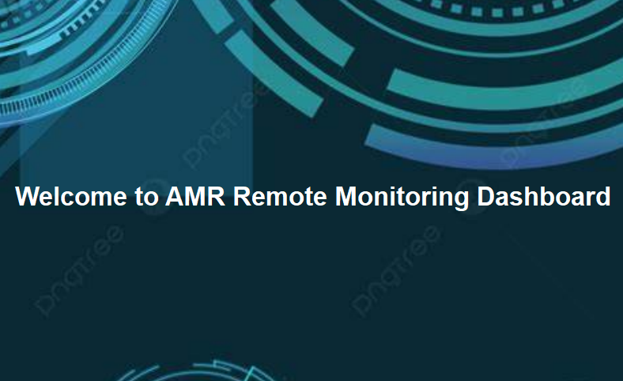

# Remote UI Interface for Autonomous Mobile Robot (AMR)

## 📌 Overview
This project presents a PyQt5-based remote user interface for controlling and monitoring an Autonomous Mobile Robot (AMR).  
The system is designed for real-time interaction with the robot through a sleek and responsive dashboard.  
It includes live sensor feedback, command dispatching, and a splash screen loader for professional UX flow.

---

## 🚀 Features
- ✅ Real-time robot control panel using **PyQt5**
- ✅ Splash screen on startup for UI initialization
- ✅ Modular UI architecture with easy extensibility
- ✅ Integrated **WebSocket-based server** for communication (`barrier_ws_server.py`)
- ✅ Background listener to receive robot updates (`listen.py`)
- ✅ Ready for ROS/Gazebo or MQTT integration in future

---

## 📂 Project Structure

| File                     | Description                                  |
|--------------------------|----------------------------------------------|
| `main.py`                | Launches the remote interface                |
| `dashboard.py`           | Implements the main dashboard logic          |
| `splash_screen.py`       | Displays a loading splash screen             |
| `listen.py`              | Listens for real-time updates                |
| `barrier_ws_server.py`   | Handles WebSocket-based communication        |
| `resources/splash.jpeg`  | Image used for splash screen                 |
| `AMR (2).pdf`            | Project documentation/report                 |
| `Interface.png`          | Main user interface layout                   |
| `Interface_with_Mapping.png` | UI with mapping overlay               |
| `Warninglog.png`         | Warning/error logging panel                  |
| `Welcome.png`            | Welcome screen view                          |
| `Welcome2.png`           | Alternate welcome screen                     |

---

## 🔧 Setup Instructions

```bash
# Clone the repository
git clone <your-repo-url>
cd Interface-main

# Install dependencies
pip install pyqt5

# Run the interface
python main.py
```

---

## 📷 Screenshots

### 🖼️ Main Interface


### 🗘️ Interface with Mapping


### ⚠️ Warning Log Panel


### 👋 Welcome Screens
  


---
